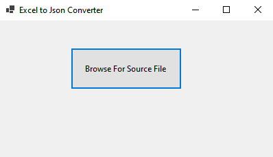

# Excel2JsonConverter
A simple tool to convert Excel files to JSON, mapping every sheet columns to object keys.

## Usage

Run the application and browse for excel file to be converted.

Every sheet will be converted to a sepatred file.

The newly created json file/s will be in the same directory as excel file.

* It's expected for excel sheet top row to have columns headers.

